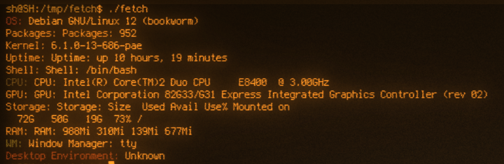

# Fetch

Fetch is a simple command-line utility written in Go (Golang) that provides detailed information about your system.
It gathers information about the operating system, packages, kernel, uptime, shell, CPU, GPU, storage, RAM, desktop, and window manager.





## Usage

### Prerequisites

Make sure that you have Go installed on your system.

### Installation

Clone the Fetch repository and build the executable:

```bash
git clone https://github.com/elbachir-one/fetch
cd fetch
go build fetch.go
```

### Run Fetch

After building the executable, run Fetch to display system information:

```bash
./fetch
```

As for installation, just put it in your PATH.
